# Sistema de Transporte Escolar SEE/MG — Proposta de Modelo de Dados e Arquitetura

> Status: **PROPOSTA — aguardando aprovação**. Nenhum código foi escrito.
> Convenções: nomes de tabelas/campos em `snake_case`, sem acento. Toda tabela tem
> `id uuid`, `criado_em`, `criado_por`, `atualizado_em`, `atualizado_por` (omitidos abaixo).
> `(!)` = campo a confirmar com você. `FK` = chave estrangeira.

---

## 1. Decisão de stack

**Mantida a sugestão: React + Vite + TypeScript + Supabase.** Para um mantenedor único é a melhor relação poder/esforço:

| Necessidade | Como o Supabase resolve | Por que importa para você |
|---|---|---|
| Regras de negócio | PostgreSQL: *views*, *triggers*, funções SQL | Você já pensa em modelo relacional; boa parte da lógica fica em SQL, legível e testável |
| Permissão por SRE | Row Level Security (RLS) | O banco recusa a linha — mesmo que o front tenha bug, a SRE A não vê dados da SRE B |
| Documentos | Storage privado + URL assinada (expira) | Atende "link temporário" e LGPD sem servidor próprio |
| Alertas de SLA/vigência | `pg_cron` (agendador dentro do banco) + Edge Function de e-mail | Sem servidor para manter |
| Power BI | Conexão direta ao PostgreSQL (views `vw_bi_*`) | Não depende de exportar CSV manualmente |

Complementos no front: **Tailwind + shadcn/ui** (componentes prontos, responsivos), **TanStack Query** (cache/carregamento de dados), **React Hook Form + Zod** (formulários com validação), **SheetJS** (exportação Excel).

Alternativa avaliada e descartada: *Power Apps + Dataverse/SharePoint* — mais rápido para telas simples, mas fraco para RLS por SRE, versionamento de documentos, fluxo com SLA e auditoria antes/depois; e depende de licenciamento.

**Ponto de atenção institucional (decisão sua, não técnica):** dados de alunos menores em nuvem de terceiros. O Supabase permite hospedar em São Paulo (`sa-east-1`) e pode ser auto-hospedado depois (ex.: PRODEMGE) sem reescrever o sistema, porque tudo é PostgreSQL padrão. Recomendo validar com o encarregado de dados (DPO) da SEE antes de ir para produção com dados reais.

---

## 2. Ideia central: o "processo" como eixo

Todos os artefatos (documentos, OP, PAF, contrato, prestação de contas, riscos) se ligam a **uma única tabela-eixo `processo`**, que carrega o **código único** e o **nº SEI**.

```
                        ┌──────────────────────────────┐
                        │ processo                     │
                        │ codigo  JUD-2026-SRE12-0007  │
                        │ numero_sei                   │
                        │ modulo  JUDICIAL | PTE       │
                        │ sre_id  (base do RLS)        │
                        └──────────────┬───────────────┘
        ┌─────────────┬────────────────┼───────────────┬──────────────┬──────────────┐
        ▼             ▼                ▼               ▼              ▼              ▼
 demanda_judicial  adesao_pte   processo_etapa    instrumento    documento    risco_ocorrencia
   (1:1)             (1:1)      (fluxo + SLA)   (contrato/termo)  (repositório)
                                                      │
                               ┌──────────┬───────────┼────────────┬──────────────┐
                               ▼          ▼           ▼            ▼              ▼
                            aditivo   parcela   fiscalizacao   ocorrencia   prestacao_contas
                                     financeira    _registro                     │
                                                                                 ▼
                                                                            diligencia
```

Vantagens:
- Buscar por código ou SEI = 1 consulta; ZIP de "tudo da demanda" = `documento where processo_id = X`.
- RLS por SRE é aplicado **uma vez** no processo e herdado pelas tabelas filhas.
- Gestão contratual, repositório, fluxo e riscos são **compartilhados** entre Judicial e PTE (sem duplicar tabelas).

---

## 3. Tabelas por domínio

### 3.1 Acesso e perfis

**`usuario`** (1:1 com `auth.users` do Supabase)
| campo | tipo | obs |
|---|---|---|
| id | uuid FK auth.users | |
| nome | text | |
| email | text | |
| papel | enum `admin`, `analista_central`, `diretor_sre`, `analista_sre` (futuro: `financeiro`, `escola`, `municipio`) | |
| sre_id | FK sre | obrigatório se papel = `diretor_sre` ou `analista_sre` |
| ativo | bool | |

Matriz de permissão (aplicada no banco via RLS):

| papel | lê | edita |
|---|---|---|
| admin | tudo | tudo + cadastros de sistema (tipos, SLAs, checklists, feriados, usuários) |
| analista_central | tudo | tudo, exceto configurações de sistema (inclui OP, PAF e repasses — não haverá perfil financeiro por ora) |
| diretor_sre (Diretor DAFI) | só processos da sua SRE | idem + autoriza avanço de etapa sem checklist completo |
| analista_sre | só processos da sua SRE | idem |

**Escalonamento de SLA** (decidido: analista SRE → Diretor DAFI → órgão central). Sem superior cadastrado por pessoa; o nível é deduzido do papel + SRE:

| nível | quando (padrão, configurável) | quem recebe |
|---|---|---|
| 1 | etapa a vencer (≤ X dias úteis) e no vencimento | responsável pela etapa |
| 2 | SLA vencido | + Diretor(es) DAFI da SRE |
| 3 | SLA vencido há 3 dias úteis **ou** prazo judicial vencido | + analistas do órgão central |

### 3.2 Cadastros compartilhados

| tabela | campos principais | relacionamentos |
|---|---|---|
| `sre` | sigla (**3 caracteres, letras e/ou números, única** — ex.: `UBE`, `MT1`), nome, municipio_sede_id | a sigla entra no código único |
| `municipio` | cod_ibge (7 dígitos), nome, sre_id | N:1 sre |
| `escola` | cod_inep, cod_see, nome, municipio_id, sre_id, endereco | N:1 municipio, sre |
| `caixa_escolar` | cnpj, razao_social, escola_id, presidente, banco/agência/conta | N:1 escola |
| `aluno` | nome, cod_simade, data_nascimento, escola_atual_id, serie, turno, ativo | ver LGPD abaixo |
| `transportador` | tipo (PF/PJ), cpf_cnpj, razao_social, contato, email | |
| `tipo_veiculo` | nome, capacidade, adaptado_pcd (bool) | |
| `preco_referencia` | sre_id, tipo_veiculo_id, unidade (`km`, `km_dia`, `mes_veiculo`, `dia`), valor, vigencia_inicio, vigencia_fim, fonte/ato | todas as unidades coexistem; vigência não pode se sobrepor para mesma SRE + veículo + unidade |
| `feriado` | data, descricao, abrangencia (nacional, estadual, municipal), municipio_id | base do cálculo de **dias úteis** |

Tipos de veículo iniciais (espelham o item 7.1 do formulário): Automóvel (até 4 passageiros), Van/micro-ônibus, Ônibus, Veículo adaptado com rampa/plataforma, Veículo com tração 4x4, Embarcação, Outro.

**LGPD — aluno:** a tabela `aluno` guarda só o mínimo (nome, código SIMADE, nascimento, escola). **CPF do aluno e do responsável não viram campo no banco**: ficam apenas nos documentos anexados (itens 8.3/8.4), que já têm acesso restrito e log. Dados de contato do responsável e de saúde ficam em tabelas separadas, com acesso restrito (ver 3.4).

### 3.3 Motor de fluxo (usado por Judicial e PTE)

**`etapa_modelo`** — a definição do fluxo (configurável pelo admin)
| campo | obs |
|---|---|
| modulo | JUDICIAL / PTE |
| ordem | 1..10 (Judicial) / 1..5 (PTE) |
| codigo, nome | ex.: `J05_AUT_FINANCEIRA` |
| sla_dias_uteis | prazo padrão da etapa em **dias úteis** (descontando sábados, domingos e `feriado`). Valor genérico inicial: 5 dias úteis por etapa, editável pelo admin |
| papel_responsavel | quem atua na etapa |
| permite_paralelo | ex.: PTE fase 4 (execução + monitoramento) |

**`processo_etapa`** — a etapa acontecendo em um processo concreto
| campo | obs |
|---|---|
| processo_id, etapa_modelo_id | |
| status | `nao_iniciada`, `em_andamento`, `concluida`, `dispensada` |
| responsavel_id | FK usuario |
| iniciada_em, prazo_sla (calculado), concluida_em | base do "tempo médio por etapa" |
| justificativa_avanco | preenchida quando avança sem checklist completo |

**`checklist_modelo`** — (etapa_modelo_id, tipo_documento_id, obrigatorio, `condicao`)
  → `condicao` torna o documento obrigatório só em certos casos (ex.: laudo 8.6 só se o aluno for PcD; declaração de inexistência de rota 8.10 só se houver rota PTE/municipal). Valores: `sempre`, `se_pcd`, `se_dispositivo_mobilidade`, `se_acompanhante`, `se_obstaculos`, `se_rota_existente`, `opcional`.
**`checklist_dispensa`** — (processo_etapa_id, tipo_documento_id, justificativa, autorizado_por)

Regra: função SQL `pode_concluir_etapa()` verifica se cada documento obrigatório existe **ou** tem dispensa assinada por papel autorizado.

**Semáforo** (view `vw_semaforo_processo`): prazo efetivo = o **menor** entre prazo judicial e prazo SLA da etapa atual.
- 🟢 no prazo: faltam mais de X dias úteis · 🟡 a vencer: ≤ X dias úteis · 🔴 vencido. X inicial = 3 dias úteis, configurável.

### 3.4 Módulo Judicial/MP

**`demanda_judicial`** (1:1 processo)
| campo | obs |
|---|---|
| processo_id | |
| origem | `judicial` / `ministerio_publico` / `outro` (+ `origem_outro` texto) — form. 1.4 |
| numero_processo_origem | nº do processo judicial ou procedimento MP — form. 1.1 |
| comarca, orgao (vara/promotoria) | |
| data_recebimento (1.3), data_ciencia, prazo_judicial (1.5), multa_diaria (opcional) | |
| prazo_devolucao_formulario | form. 1.6 — vira o prazo da etapa 3 |
| decisao_resumo | |
| escola_id, caixa_escolar_id | form. 1.8–1.10 (município vem da escola) |
| responsavel_sre_id | FK usuario — form. 1.11 |
| situacao | `ativa`, `cumprida`, `encerrada`, `suspensa` |

**`demanda_aluno`** — N:N (uma demanda tem vários alunos; um aluno pode estar em várias demandas)
`demanda_id, aluno_id, incluido_em, removido_em, motivo`

#### Caracterização — espelho do formulário FOR_Caracterizacao (Etapa 3)

Um formulário por **aluno da demanda** (`demanda_aluno`). Dividido em 4 tabelas por nível de sensibilidade (LGPD):

| tabela | seções do form. | acesso |
|---|---|---|
| `caracterizacao` | 2 (complemento), 4, 6, 7, 9, 10 | normal (central + SRE da demanda) |
| `responsavel_legal` | 3 | restrito: só leitura com registro em log |
| `caracterizacao_saude` | 5 | **restrito**: só leitura com registro em log |
| `caracterizacao_estudante_trajeto` | 6.3 | normal |

**`caracterizacao`**
| grupo | campos (entre parênteses, o item do formulário) |
|---|---|
| controle | demanda_aluno_id, versao, status (`rascunho`, `enviada`, `em_diligencia`, `aprovada`) |
| estudante (2) | turma_ano (2.6), turno (`manha`, `tarde`, `noite`, `integral`) (2.7), horario_entrada (2.8), horario_saida (2.9), dias_semana `text[]` (2.10), contraturno (bool) + contraturno_detalhe (2.11), escola_mais_proxima + motivo_nao_atendimento (2.12) |
| trajeto (4) | endereco_residencia (4.1), ponto_referencia (4.2), latitude, longitude, link_mapa (4.3), zona (`urbana`, `rural`) (4.4), distancia_km_ida (4.5), tempo_ida_min (4.6), viagens_dia (4.7), tipo_via (`asfalto`, `cascalho`, `terra`, `misto`) (4.8), condicao_via (`boa`, `regular`, `ruim_chuva`) (4.9), obstaculos `text[]` (4.10: `ponte_restricao_peso`, `balsa`, `aclive`, `atoleiro`, `passagem_molhada`, `largura_insuficiente`, `nenhum`), veiculo_chega_residencia (bool) + distancia_ponto_embarque_m (4.11), exige_4x4 (`nao`, `ano_todo`, `periodo_chuvoso`) (4.12), rota_existente (`nao_existe`, `nao_atende_horario`, `nao_atende_endereco`, `pode_atender`) + rota_identificacao (4.13) |
| compartilhamento (6) | outros_estudantes_trajeto (bool) + qtd (6.1), outros_com_demanda_judicial (bool) + qtd (6.2), viavel_mesmo_veiculo (bool) + justificativa (6.4) |
| proposta (7) | tipo_veiculo_indicado_id + tipo_veiculo_outro (7.1), lotacao (7.2), km_diario_total (7.3), dias_letivos_periodo (7.4), requisitos `text[]` (7.5: `cnh_d_curso`, `detran_inspecao`, `cinto_todos`, `retencao_infantil`, `acompanhante`, `veiculo_acessivel`), justificativa_tecnica (7.6), periodo_atendimento (`ano_letivo`, `ate_nova_decisao`, `outro`) + detalhe (7.7), data_inicio_pretendida (7.8), valor_estimado_mensal (7.9) |
| pendências (8.12) | documentos_pendentes, prazo_entrega_pendentes |
| declaração (9) | local, data_declaracao, diretor_nome, diretor_masp, presidente_caixa_nome, responsavel_ciente (bool) — a assinatura em si é o PDF assinado anexado |
| análise (10) | data_recebimento_formulario (10.1), documentacao_completa (bool) + data_diligencia (10.2), analista_id (10.3), tipo_veiculo_aprovado_id (10.4), valor_referencia_aprovado (10.5), parecer (10.6), data_analise (10.7) |

**`responsavel_legal`** (3): caracterizacao_id, nome, grau_parentesco, telefone_principal, telefone_alternativo, email, acompanha_trajeto (`sempre`, `as_vezes`, `nao`), observacoes. *CPF não é armazenado como campo (fica no documento 8.4).*

**`caracterizacao_saude`** (5): caracterizacao_id, pcd_mobilidade_reduzida (bool) + especificacao (5.1), dispositivo_mobilidade (`nenhum`, `cadeira_manual_dobravel`, `cadeira_motorizada`, `andador`, `muletas`, `outro`) + outro (5.2), dispositivo_medidas_peso (5.3), transferencia_assento (`sozinho`, `com_auxilio`, `nao_transfere`) (5.4), necessita_rampa_plataforma (5.5), necessita_acompanhante + tipo_acompanhante (`familiar`, `cuidador`, `profissional_apoio`) (5.6), dispositivo_retencao (`nao`, `bebe_conforto`, `cadeirinha`, `booster`) + altura_cm + peso_kg (5.7), condicoes_saude_procedimento (5.8), medicacao_trajeto (bool) + detalhe (5.9), condicao_sensorial_comportamental (5.10), tempo_max_permanencia_min (5.11), observacoes_escola (5.12).

**`caracterizacao_estudante_trajeto`** (6.3): caracterizacao_id, aluno_id (se já cadastrado) **ou** nome, matricula, turno, endereco.

**Regra "não se aplica"** (orientação 1 do formulário): na tela, todo campo de texto tem o botão "Não se aplica"; o formulário só pode ser marcado como `enviada` com todos os campos preenchidos.

**Checklist da etapa 3** (seção 8 → `checklist_modelo`):

| item | documento | condição |
|---|---|---|
| 8.1 | Decisão judicial / requisição MP | sempre (já vem da etapa 1) |
| 8.2 | Comprovante de matrícula / declaração escolar | sempre |
| 8.3 | Identidade ou certidão de nascimento do estudante | sempre |
| 8.4 | CPF do estudante e do responsável legal | sempre |
| 8.5 | Comprovante de residência (até 90 dias) | sempre — alerta se `data_documento` tiver mais de 90 dias |
| 8.6 | Laudo / relatório / declaração de deficiência com CID | `se_pcd` |
| 8.7 | Prescrição de dispositivo de mobilidade ou acompanhante | `se_dispositivo_mobilidade` ou `se_acompanhante` |
| 8.8 | Registro fotográfico do trajeto e obstáculos | `se_obstaculos` |
| 8.9 | Mapa / captura com rota e distância | opcional |
| 8.10 | Declaração de inexistência de rota PTE/municipal | quando 4.13 ≠ `pode_atender` |
| 8.11 | Termo de ciência e consentimento LGPD | **sempre** (decidido) |
| — | Formulário de caracterização assinado (PDF) | sempre |

**`cotacao`** — Etapa 4: `demanda_id, fornecedor_nome, cpf_cnpj, valor, data, documento_id`
**`definicao_valor`** — Etapa 4: `demanda_id, metodo (tres_cotacoes | preco_referencia), preco_referencia_id, cotacao_escolhida_id, valor_mensal, valor_total, periodo_meses`
  → view indica automaticamente a menor cotação; se método = cotações, exige ≥ 3.

**`autorizacao_financeira`** — Etapa 5 (OP e PAF em paralelo): `demanda_id, tipo (OP | PAF), numero, data, valor`
  → etapa conclui quando existe 1 OP **e** 1 PAF.

**`liberacao_recurso`** — Etapa 6: `demanda_id, caixa_escolar_id, data, valor, numero_ordem_bancaria (!)`

**Etapa 7 (Contratação)** → cria um `instrumento` tipo `contrato_caixa` (Gestão Contratual) + `procedimento_compra` (modalidade, número, data).
**Etapa 8 (Execução)** → `fiscalizacao_registro` e `ocorrencia` do instrumento; `data_inicio_transporte` na demanda.
**Etapa 9 (Prestação de contas)** → `prestacao_contas` compartilhada.
**Etapa 10 (Cumprimento)** → `relatorio_cumprimento`: `demanda_id, gerado_em, gerado_por, documento_id (PDF gerado), enviado_age_em`.

### 3.5 Módulo PTE

**`ciclo_pte`**: `ano, status (planejamento, adesao, calculo, execucao, prestacao, encerrado), aprovado_em, aprovado_por`
**`ciclo_parametro`**: `ciclo_id, chave, valor, descricao` — chave-valor porque as regras de cálculo ainda serão detalhadas (!)
**`ciclo_marco`**: cronograma — `ciclo_id, marco, data_prevista, data_realizada`

**`adesao_pte`** (1:1 processo — é o "PTE-2026-3106200-001"): `ciclo_id, municipio_id, data_adesao, status`

**`pte_aluno_informado`** (base TER/MG enviada pelo município): `adesao_id, aluno_id, cod_simade, escola_id, distancia_km, zona (rural/urbana), turno, tipo_veiculo_id`
**`simade_importacao`** / **`simade_registro`**: lote importado do SIMADE (staging, via CSV/Excel)
**`conciliacao_divergencia`**: `adesao_id, cod_simade, tipo (nao_encontrado_simade, escola_divergente, inativo, duplicado_outro_municipio, …), status (aberta, justificada, corrigida), resolucao`

**`calculo_repasse`**: `adesao_id, qtd_alunos, km_total, valor_calculado, memoria_calculo (jsonb), versao` — aprovação é única por ciclo (em `ciclo_pte`)
**`demanda_extraordinaria`**: `adesao_id, tipo (inclusao_aluno | reanalise_repasse), justificativa, status, valor_impacto, decidido_em`

Termo/convênio → `instrumento` tipo `termo_pte`; parcelas/repasses → `parcela_financeira`; prestação → `prestacao_contas`.

### 3.6 Gestão contratual (compartilhada)

**`instrumento`**
| campo | obs |
|---|---|
| processo_id | amarra ao código único |
| tipo | `contrato_caixa` (Caixa × transportador) / `termo_pte` (Estado × município) |
| numero, objeto, data_assinatura | |
| contratante: `caixa_escolar_id` ou "Estado/SEE" | |
| contratado: `transportador_id` ou `municipio_id` | + CNPJ/CPF denormalizado para histórico |
| vigencia_inicio, vigencia_fim_original | |
| valor_global_original, dotacao_orcamentaria | |
| gestor_id, fiscal_id | FK usuario (decidido: sempre usuários do sistema, por ora) |
| status | `vigente`, `encerrado`, `rescindido`, `suspenso` |

**`aditivo`**: `instrumento_id, numero, data_assinatura, altera_prazo, nova_vigencia_fim, altera_valor, valor_variacao (+ acréscimo / − supressão), altera_rota_veiculo, descricao, documento_id`

**`vw_instrumento_situacao`** (view — recálculo automático, nunca "digitado"):
`vigencia_fim_atual` (último aditivo de prazo), `valor_atual` (original + Σ variações), `valor_executado` (Σ pagos), `saldo`, `% executado`, `dias_para_vencer`, `faixa_alerta` (90/60/30/vencido).

**`parcela_financeira`**: `instrumento_id, tipo (pagamento | repasse), numero, competencia, valor_previsto, data_prevista, valor_pago, data_pagamento, documento_id`
**`fiscalizacao_registro`**: `instrumento_id, competencia (mês), dias_rodados, alunos_transportados, km_rodados, fiscal_id, observacao`
**`ocorrencia`**: `instrumento_id, processo_id, data, tipo (atraso, interrupcao, veiculo_irregular, …), gravidade, descricao, providencia, status`
**`notificacao_contratado`**: `instrumento_id, ocorrencia_id, data, prazo_resposta, respondida_em, documento_id`
**`prestacao_contas`**: `processo_id, instrumento_id, periodo, data_limite, data_entrega, status (pendente, em_analise, em_diligencia, reapresentada, aprovada, aprovada_ressalvas, reprovada), parecer, analista_id`
**`diligencia`**: `prestacao_id, data, descricao, prazo, respondida_em` — **no máximo 1 por prestação** (ciclo único), garantido por restrição `unique`.
**`encerramento`**: `instrumento_id, data, situacao_final, pendencias, documento_id`

**Linha do tempo**: view `vw_linha_tempo_instrumento` que une em ordem cronológica assinatura, aditivos, parcelas, fiscalizações, ocorrências, prestações e encerramento. Não precisa de tabela própria.

### 3.7 Repositório de documentos

**`tipo_documento`**: `nome, modulo (JUDICIAL, PTE, AMBOS), exige_numero_sei, ativo`

**`documento`** (o documento "lógico")
| campo | obs |
|---|---|
| processo_id | **obrigatório** |
| tipo_documento_id | |
| processo_etapa_id, aluno_id, instrumento_id, aditivo_id, prestacao_id | vínculos opcionais |
| numero_sei, data_documento, observacao | |
| versao_atual | número |

**`documento_versao`** (o arquivo físico — nova versão = nova linha, nada é apagado)
`documento_id, versao, storage_path, nome_arquivo, mime (pdf/jpg/png), tamanho_bytes (≤ 20 MB), hash_sha256, enviado_por, enviado_em`

**`log_acesso_documento`**: `documento_versao_id, usuario_id, acao (visualizar, baixar, zip), em` — exigência LGPD.

Storage: bucket privado `documentos/{processo_codigo}/{documento_id}/v{n}.pdf`; acesso só via URL assinada de 5 min gerada após checar permissão.
ZIP em lote: Edge Function que empacota os documentos do processo/instrumento e registra no log.

### 3.8 Riscos — REMOVIDO (D42)

Modelo clássico de registro de riscos (probabilidade × impacto), com gatilhos automáticos.

**`risco`**
| campo | obs |
|---|---|
| codigo | `R-01`, `R-02`… |
| titulo, descricao | |
| categoria | `prazo`, `financeiro`, `contratual`, `operacional`, `seguranca_aluno`, `conformidade_lgpd`, `informacao` |
| modulo | `JUDICIAL`, `PTE`, `AMBOS` |
| causa, consequencia | |
| probabilidade, impacto | 1 a 5 |
| nivel | calculado = P × I → `baixo` (1–4), `medio` (5–9), `alto` (10–15), `critico` (16–25) |
| estrategia | `evitar`, `mitigar`, `transferir`, `aceitar` |
| plano_acao, responsavel_id, data_revisao | |
| gatilho_automatico | código da regra que gera ocorrência sozinha (ou vazio = só manual) |
| status | `ativo`, `monitorado`, `encerrado` |

**`risco_etapa`**: N:N `risco_id, etapa_modelo_id`
**`risco_ocorrencia`**: `risco_id, processo_id, instrumento_id, data, descricao, origem (manual | automatica), impacto_real, acao_tomada, status (aberta, tratada, encerrada)`

Registro inicial sugerido (seed, editável):

| código | risco | gatilho automático |
|---|---|---|
| R-01 | Descumprimento de prazo judicial | `prazo_judicial_vencido` |
| R-02 | Etapa do fluxo acima do SLA | `sla_vencido_nivel3` |
| R-03 | Caracterização incompleta / documentação pendente | `checklist_pendente_prazo` |
| R-04 | Cotações insuficientes ou preço acima da referência | `valor_acima_referencia` |
| R-05 | Atraso na emissão de OP/PAF ou na liberação do recurso | `sla_etapa_5_6` |
| R-06 | Contrato vencido sem aditivo com transporte em curso | `contrato_vencido_sem_aditivo` |
| R-07 | Interrupção do transporte | ocorrência do tipo `interrupcao` |
| R-08 | Veículo/condutor sem requisitos legais (CNH D, DETRAN) | ocorrência do tipo `veiculo_irregular` |
| R-09 | Prestação de contas não entregue no prazo | `prestacao_vencida` |
| R-10 | Divergência TER × SIMADE não resolvida (PTE) | `divergencia_aberta_prazo` |
| R-11 | Saldo contratual insuficiente | `saldo_menor_10pct` |
| R-12 | Acesso indevido a dados de aluno (LGPD) | — (manual) |

O `pg_cron` roda as regras diariamente e cria a ocorrência (sem duplicar).

### 3.9 Alertas (REMOVIDO — D42) e auditoria (mantida)

**`alerta`**: `tipo (sla_etapa, prazo_judicial, vigencia_90/60/30, prestacao_vencer/vencida), processo_id, instrumento_id, destinatario_id, nivel (1 = responsável, 2 = superior), gerado_em, email_enviado_em, lido_em` — `unique` impede alerta duplicado.

**`audit_log`**: `tabela, registro_id, operacao (INSERT/UPDATE/DELETE), antes jsonb, depois jsonb, usuario_id, em`
→ trigger genérico em todas as tabelas de negócio. **Recomendo ligar já na Fase 1** (e não esperar a Fase 7), senão perdemos o histórico das fases iniciais. Na Fase 7 fica só a tela de consulta.

---

## 4. Diagrama ER (núcleo)

```mermaid
erDiagram
  SRE ||--o{ MUNICIPIO : abrange
  SRE ||--o{ ESCOLA : jurisdiciona
  MUNICIPIO ||--o{ ESCOLA : sedia
  ESCOLA ||--o| CAIXA_ESCOLAR : possui
  SRE ||--o{ USUARIO : lota
  SRE ||--o{ PROCESSO : "RLS por"

  PROCESSO ||--o| DEMANDA_JUDICIAL : "1:1"
  PROCESSO ||--o| ADESAO_PTE : "1:1"
  PROCESSO ||--o{ PROCESSO_ETAPA : fluxo
  ETAPA_MODELO ||--o{ PROCESSO_ETAPA : instancia
  ETAPA_MODELO ||--o{ CHECKLIST_MODELO : exige
  TIPO_DOCUMENTO ||--o{ CHECKLIST_MODELO : ""

  DEMANDA_JUDICIAL ||--o{ DEMANDA_ALUNO : ""
  ALUNO ||--o{ DEMANDA_ALUNO : ""
  DEMANDA_ALUNO ||--o| CARACTERIZACAO : ""
  CARACTERIZACAO ||--o| CARACTERIZACAO_SAUDE : "restrito"
  CARACTERIZACAO ||--o| RESPONSAVEL_LEGAL : "restrito"
  CARACTERIZACAO ||--o{ CARACTERIZACAO_ESTUDANTE_TRAJETO : "6.3"
  DEMANDA_JUDICIAL ||--o{ COTACAO : ""
  DEMANDA_JUDICIAL ||--o| DEFINICAO_VALOR : ""
  DEMANDA_JUDICIAL ||--o{ AUTORIZACAO_FINANCEIRA : "OP + PAF"
  DEMANDA_JUDICIAL ||--o{ LIBERACAO_RECURSO : ""

  CICLO_PTE ||--o{ ADESAO_PTE : ""
  MUNICIPIO ||--o{ ADESAO_PTE : ""
  ADESAO_PTE ||--o{ PTE_ALUNO_INFORMADO : ""
  ADESAO_PTE ||--o{ CONCILIACAO_DIVERGENCIA : ""
  ADESAO_PTE ||--o{ CALCULO_REPASSE : ""
  ADESAO_PTE ||--o{ DEMANDA_EXTRAORDINARIA : ""

  PROCESSO ||--o{ INSTRUMENTO : ""
  INSTRUMENTO ||--o{ ADITIVO : ""
  INSTRUMENTO ||--o{ PARCELA_FINANCEIRA : ""
  INSTRUMENTO ||--o{ FISCALIZACAO_REGISTRO : ""
  INSTRUMENTO ||--o{ OCORRENCIA : ""
  INSTRUMENTO ||--o{ PRESTACAO_CONTAS : ""
  PRESTACAO_CONTAS ||--o| DILIGENCIA : "ciclo unico"
  INSTRUMENTO ||--o| ENCERRAMENTO : ""

  PROCESSO ||--o{ DOCUMENTO : ""
  TIPO_DOCUMENTO ||--o{ DOCUMENTO : ""
  DOCUMENTO ||--|{ DOCUMENTO_VERSAO : versiona
  DOCUMENTO_VERSAO ||--o{ LOG_ACESSO_DOCUMENTO : ""

  RISCO ||--o{ RISCO_ETAPA : ""
  ETAPA_MODELO ||--o{ RISCO_ETAPA : ""
  RISCO ||--o{ RISCO_OCORRENCIA : ""
  PROCESSO ||--o{ RISCO_OCORRENCIA : ""
```



---

## 5. Estrutura de pastas

```
transporte-escolar/
├─ docs/                          # esta proposta, decisões, manual de teste por fase
├─ supabase/
│  ├─ migrations/                 # SQL versionado, 1 arquivo por mudança
│  │   ├─ 0001_cadastros.sql
│  │   ├─ 0002_usuarios_rls.sql
│  │   ├─ 0003_auditoria.sql
│  │   └─ ...
│  ├─ seed.sql                    # dados FICTÍCIOS (SREs reais, alunos inventados)
│  ├─ tests/                      # testes SQL das regras (RLS, checklist, semáforo)
│  └─ functions/                  # Edge Functions (TypeScript, rodam no Supabase)
│      ├─ enviar-alertas/         # e-mails de SLA/vigência
│      ├─ zip-documentos/
│      └─ gerar-relatorio-cumprimento/
├─ src/
│  ├─ app/                        # rotas, layout, menu, proteção por papel
│  ├─ lib/                        # cliente Supabase, formatação (R$, datas, CNPJ), utilidades
│  ├─ components/
│  │   ├─ ui/                     # componentes base (botão, tabela, modal) – shadcn
│  │   └─ comum/                  # Semaforo, UploadDocumento, LinhaDoTempo, ChecklistEtapa
│  ├─ features/                   # uma pasta por módulo, mesma estrutura interna
│  │   ├─ auth/
│  │   ├─ cadastros/
│  │   ├─ documentos/
│  │   ├─ contratos/
│  │   ├─ judicial/
│  │   ├─ pte/
│  │   ├─ painel/
│  │   ├─ riscos/
│  │   └─ auditoria/
│  │       (cada uma: pages/, components/, api.ts, schemas.ts)
│  └─ types/database.ts           # tipos gerados automaticamente a partir do banco
├─ .env.example
└─ package.json
```

Princípio: **regra de negócio crítica no banco** (checklist, cálculo de saldo/vigência, semáforo, RLS), **tela no React**. Assim o Power BI e o sistema sempre veem os mesmos números.

---

## 6. Registro de decisões

| # | decisão | data |
|---|---|---|
| D1 | Stack React + Vite + TS + Supabase (nuvem, região São Paulo; sem Docker local) | 30/09/2026 |
| D2 | Código único usa sigla da SRE com 3 caracteres alfanuméricos: `JUD-2026-UBE-0001`; sequencial reinicia por ano e por SRE | 30/09/2026 |
| D3 | Escalonamento: analista SRE → Diretor DAFI → órgão central | 30/09/2026 |
| D4 | Sem perfil financeiro por ora; OP/PAF/repasses lançados pelo órgão central | 30/09/2026 |
| D5 | Aluno com dados mínimos; CPF só no documento anexo, não como campo | 30/09/2026 |
| D6 | SLA em dias úteis (com tabela de feriados); valores genéricos por ora | 30/09/2026 |
| D7 | Preço de referência aceita várias unidades (km, km/dia, mês/veículo, dia) | 30/09/2026 |
| D8 | Gestor e fiscal do contrato são usuários do sistema | 30/09/2026 |
| D9 | Parâmetros do PTE em chave/valor até as regras serem detalhadas | 30/09/2026 |
| D10 | Caracterização espelha o formulário FOR_Caracterizacao; saúde e responsável em tabelas restritas | 30/09/2026 |
| D11 | Registro de riscos com estrutura própria (P × I, gatilhos automáticos) | 30/09/2026 |
| D12 | Desenvolvimento sem banco por ora ("modo demonstração": localStorage + login simulado); Supabase entra depois trocando só `src/lib/dados/` | 30/09/2026 |
| D13 | CNPJ validado também no formato alfanumérico (Receita Federal, jul/2026) | 30/09/2026 |
| D14 | SRE consulta escolas e preços; edita alunos, Caixas Escolares e transportadores (da sua regional) | 30/09/2026 |
| D15 | Transportadores: cadastro único, visível a todas as SREs | 30/09/2026 |
| D16 | Checklist: 8.10 exigido quando 4.13 ≠ "existe e pode atender"; 8.11 (termo LGPD) sempre obrigatório | 30/09/2026 |
| D17 | Gestão contratual (Fase 3) antecipada, antes do repositório de documentos; anexos referenciados por nº SEI até a Fase 2 | 30/09/2026 |
| D18 | Encerramento guardado no próprio instrumento (`encerrado_em`, `situacao_final`, `pendencias_encerramento`, `termo_encerramento_sei`) em vez de tabela separada | 30/09/2026 |
| D19 | Diligência guardada na própria prestação de contas (ciclo único garante no máximo uma) | 30/09/2026 |
| D20 | Aditivo assinado após o fim da vigência é recusado; acréscimos > 25% geram só alerta | 30/09/2026 |
| D21 | Enquanto não há módulos Judicial/PTE, cada instrumento gera o próprio processo (código único) | 30/09/2026 |
| D22 | Fases 2, 4, 5, 6 e 7 construídas de uma vez para revisão posterior (pedido do usuário) | 30/09/2026 |
| D23 | Arquivos no IndexedDB do navegador (modo demonstração); metadados e versões em tabelas; nada é apagado | 30/09/2026 |
| D24 | Checklist verificado por processo (documento do tipo exigido em qualquer etapa do processo atende) | 30/09/2026 |
| D25 | Requisitos de DADOS da etapa (ex.: OP e PAF registrados) não são dispensáveis; só documentos podem ser dispensados, com justificativa do Diretor DAFI ou órgão central | 30/09/2026 |
| D26 | Prazo judicial deixa de contar no semáforo quando o transporte é iniciado | 30/09/2026 |
| D27 | Escalonamento: nível 1 a vencer (≤ 3 dias úteis); nível 2 vencida ou prazo judicial próximo; nível 3 vencida há > 3 dias úteis ou prazo judicial vencido | 30/09/2026 |
| D28 | PTE: fórmula provisória = alunos válidos × valor/aluno + km/dia × valor/km × dias letivos; aluno com divergência aberta não conta | 30/09/2026 |
| D29 | Etapa "1. Planejamento do ciclo" do PTE fica no nível do ciclo; cada adesão percorre as etapas 2 a 5 | 30/09/2026 |
| D30 | Caracterização: seção 6.3 (outros estudantes) como texto livre, não como tabela separada | 30/09/2026 |
| D31 | Dados de saúde e do responsável legal não entram na exportação CSV (LGPD) | 30/09/2026 |
| D32 | Alertas por e-mail simulados numa caixa de saída; em produção, agendador diário + servidor de e-mail | 30/09/2026 |
| D33 | Instrumento ganha periodicidade de prestação de contas e prazo; botões de gerar cronograma e prestações previstas | 30/09/2026 |
| D34 | Documentos obrigatórios de veículos, condutores e contratados conforme levantamento legal (docs/02-exigencias-documentais.md), em catálogo editável com base legal e validade | 30/09/2026 |
| D35 | Exigências "Lei" e "Norma SEE" bloqueiam a conclusão da contratação (J07) e da definição/repasse do PTE (P03); "Recomendadas" só avisam | 30/09/2026 |
| D36 | Documento a vencer = até 30 dias; prontuário do condutor conferido a cada 12 meses (critério adotado) | 30/09/2026 |
| D37 | PTE segue a Res. Conjunta SEE/SEGOV 5.267/2026: cálculo por rota (km × custo/km × 200 × estaduais ÷ passageiros), menos PNATE estadual e saldo reprogramado; 10 repasses (fev–nov); prestação anual até 28/02 | 30/09/2026 |
| D38 | Inconsistências do TER/MG (art. 13) viram divergências de rota; custo "muito acima da média" = mais de 1,5× a média do ciclo (critério adotado) | 30/09/2026 |
| D39 | PTE registra quem o município contratou (Lei 14.133), frota própria, veículos/condutores alocados, rotas e despesas (comprovação em 30 dias úteis) | 30/09/2026 |
| D40 | Sistema dividido em dois módulos: Transporte Escolar e Cadastros (administração dentro de Cadastros) | 30/09/2026 |
| D41 | Documentos de veículo/condutor/contratado não pertencem a um processo e ficam visíveis a todos os perfis (com log de acesso) | 30/09/2026 |
| D42 | Removidos alertas por e-mail, registro de riscos e exportação CSV/Power BI (a pedido). Mantidos: alertas na tela, semáforo/escalonamento visual, CSV das listas e auditoria | 30/09/2026 |
| D43 | Sem páginas avulsas de Documentos e de Frota: documentos e conformidade ficam só dentro de cada demanda, adesão e contrato | 30/09/2026 |
| D44 | Judicial/MP com submenus por etapa (fila de demandas com "o que falta") e demanda organizada pelas 10 etapas, cada uma com seus dados, checklist e conclusão | 30/09/2026 |
| D45 | Etapas 4–6 (valor/cotações, OP/PAF, liberação) substituídas por **4. Autorização do subsecretário** (novo perfil Subsecretário(a); dossiê do processo; aprova com valor mensal × meses ou devolve à etapa 3 com parecer obrigatório) e **5. Registro do PAF** (número oficial, data de criação, vigência automática de 5 anos, valor ≤ autorizado, CNPJ de destino). Cotações e OP removidas; fluxo judicial com 9 etapas. Tabelas novas: autorizacoes_subsecretario, pafs | 30/09/2026 |
| D46 | Removidas do fluxo Judicial/MP as etapas Prestação de contas e Comprovação do cumprimento (e o relatório para AGE/Judiciário). O fluxo tem 7 etapas; concluir Execução e fiscalização marca a demanda como cumprida. A prestação de contas continua na gestão do contrato e no PTE | 30/09/2026 |
| D47 | Etapa 6 (Contratos): formulário próprio de cadastro do contrato (nº, empresa escolhida do cadastro de transportadores com CNPJ, valor contratado, assinatura, vigência, garantia — Lei 14.133 art. 96 — com valor e validade, valor executado, dotação, gestor e fiscal). O **valor executado é informado manualmente** (`instrumentos.valor_executado`) e o saldo é calculado (valor atual − executado); sem valor manual, o executado continua sendo a soma dos pagamentos registrados | 30/09/2026 |
| D48 | Judicial/MP em dois fluxos. **Ofícios** (`oficios`, código OFC-ano-seq, pasta de documentos própria): cadastrados só pelo órgão central; situação calculada (aguardando análise → aguardando informação da SRE → informação recebida → respondido); pedido de informação à SRE em `oficio_consultas` com prazo padrão de 5 dias úteis; a SRE só vê os ofícios encaminhados a ela; a resposta (nº, data, resumo) só pode ser registrada sem pedido pendente. **Cumprimento de sentença**: nasce de ofício de intimação (botão "Iniciar cumprimento", que copia processo, comarca, órgão, datas e prazo) e começa na Caracterização; etapas renumeradas C01–C05; Recebimento e Encaminhamento saíram do fluxo. Reiterações e outros ofícios podem ser vinculados a um cumprimento existente (`oficios.demanda_id`) | 30/09/2026 |

Pendentes: nenhum bloqueante no momento.
